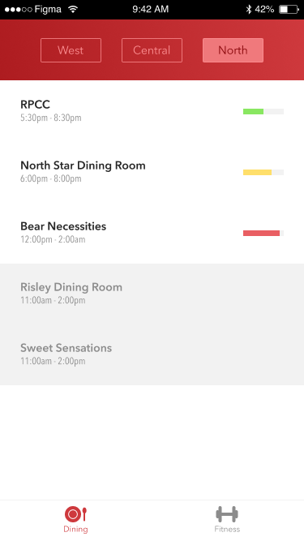
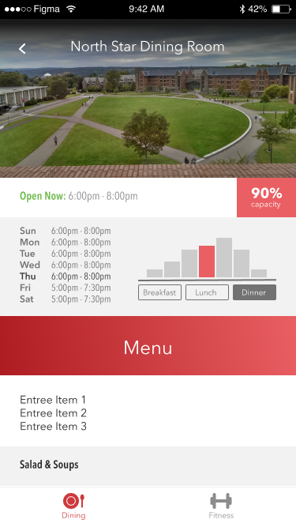
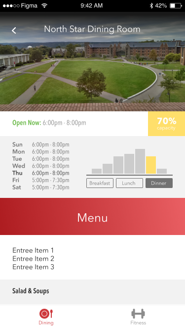
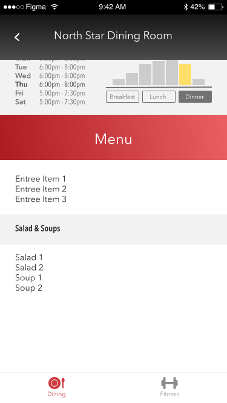
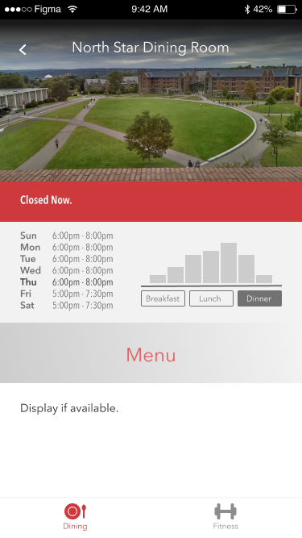

# CornellPulse

Everyday thousands of Cornell students use dining halls and fitness facilities on campus. To help Cornell increase its urban planning efficiency and give students the ability to better plan their daily schedules Cornell University has provided us with an API to compile, analyze and visualize the real time traffic data of Cornell's dining and fitness facilities.

The app displays the current activity (idea: people/room capacity) for dining/fitness locations over time and compares it to the weekly average.

We plan to launch it by Spring 2017.

Final Designs:
<!---->

Dining Hall Overview

Detailed Dining Page1

Detailed Dining Page2

Detailed Dining Page Bottom

Detailed Dining Page Closed

